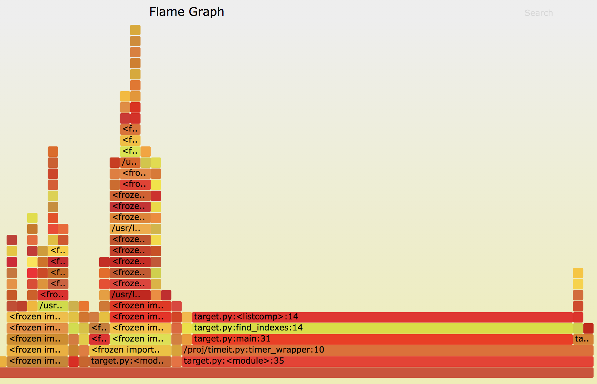
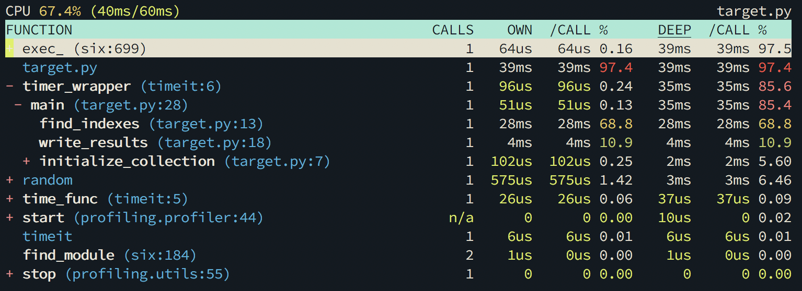

# PERFORMACE PROFILING IN PYTHON

## Performance
Computer performance is the amount of work accomplished by a computer system. Depending on the context, computer performance may involve one or more of the following:

1. Response time for a given piece of work
1. High throughput (rate of processing work)
1. Low utilization of computing resource(s)
1. High availability of the computing system or application
1. High bandwidth
1. Short data transmission time

As soon as your code stops being trivial and runs on real-world data volumes, you will run into performance issues.  

You’ve heard that Python is slow, so it must be the culprit! Right?

Sure, Python is not compiled to optimized native code and therefore won’t rival C, C++ in tightly nested loops but most Python performance issues can be alleviated by using the right tool for the job:
* Use the right data structures 
* Use the right algorithms
* Use builtin functions and libraries
* Use C equivalents of libraries
* Write idiomatic code
* Use existing optimized packages for specialized tasks (Numpy, ScyPy)
* Avoid wait time by writing asynchronous code

## When and what to optimize
"Premature optimization" is a phrase used to describe a situation where a programmer lets performance considerations affect the design of a piece of code. This can result in a design that is not as clean as it could have been or code that is incorrect, because the code is complicated by the optimization and the programmer is distracted by optimizing.

>"The real problem is that programmers have spent far too much time worrying about efficiency in the wrong places and at the wrong times; premature optimization is the root of all evil (or at least most of it) in programming."  
>-- <cite>Donald Knuth, 1968, "The Art of Computer Programming"</cite>

>"We should forget about small efficiencies, say about 97% of the time: premature optimization is the root of all evil. Yet we should not pass up our opportunities in that critical 3%"  
>-- <cite>Donald Knuth, 1974, "Structured Programming with go to Statements" 1974</cite>

When deciding whether to optimize a specific part of the program we should always consider the impact on how much time is actually spent in that specific part, which is not clear from just looking at the code without a performance analysis. 

>"If you can’t measure it, you can’t improve it."  
>-– Peter Drucker

## Python profiling functions
One way to measure performance is with a stopwatch.  
Start the clock when a unit of code such as a function begins, and stop it when the code returns.  
This is a the simplest method, and we can instrument our code to start and stop the clock.

```python
import time

def time_func(func):
    def timer_wrapper(*args, **kwargs):
        """a decorator which prints execution time of the decorated function"""
        t1 = time.time()
        result = func(*args, **kwargs)
        t2 = time.time()
        print("%s executed in %.4f seconds" % (func.__name__, (t2 - t1)))
        return result
    return timer_wrapper

@timer_func
def function_to_execute():
    time.sleep(1)

function_to_execute()
```

Python comes out of the box with extension points that allows us to implement our own Python souce code profiler in Python:
```python
sys.setprofile(profilefunc)  
```
Profile functions should have three arguments: frame, event, and arg. Frame is the current stack frame. Event is a string: 'call', 'line', 'return', 'exception' or 'opcode'. Arg depends on the event type.

Performace profiles
===================
* ### Sampling profiling
The sampling profiling method collects statistical data about the work that is performed by an application during a profiling run. The sampling method is lightweight and has little effect on the execution of the application.

The sampling profiling method interrupts the computer processor at set intervals and collects the function call stack. Exclusive sample counts are incremented for the function that is executing and inclusive counts are incremented for all of the calling functions on the call stack. Sampling reports present the totals of these counts for the profiled module, function, source code line, and instruction.

__The sampling profiling doesn't give information about the number of times each method is being called!__

* ### Instrumentation profiling
Instrumenting profilers insert special code at the beginning and end of each routine to record when the routine starts and when it exits. With this information, the profiler aims to measure the actual time taken by the routine on each call. This type of profiler may also record which other routines are called from a routine. It can then display the time for the entire routine and also break it down into time spent locally and time spent on each call to another routine.

__Instrumenting a program can cause performance changes, and may in some cases lead to inaccurate results!__

Profilers
=========

* <a href="https://docs.python.org/3/library/profile.html" target="_blank"><H2>cProfile</H2></a>Python standard library provided profiler, recommended for most users. It is a C extension with reasonable overhead that makes it suitable for profiling long-running programs.  
These statistics can be formatted into reports via the pstats module.
```
python -m cProfile -s cumtime target.py
         10075 function calls in 0.054 seconds

   Ordered by: cumulative time

   ncalls  tottime  percall  cumtime  percall filename:lineno(function)
        1    0.010    0.010    0.054    0.054 target.py:1(<module>)
        1    0.000    0.000    0.034    0.034 timeit.py:6(timer_wrapper)
        1    0.000    0.000    0.034    0.034 target.py:28(main)
        1    0.001    0.001    0.025    0.025 target.py:13(find_indexes)
     2500    0.025    0.000    0.025    0.000 {method 'index' of 'list' objects}
        1    0.005    0.005    0.010    0.010 random.py:40(<module>)
        1    0.001    0.001    0.007    0.007 target.py:18(write_results)
        1    0.004    0.004    0.004    0.004 hashlib.py:56(<module>)
        1    0.003    0.003    0.003    0.003 {open}
     2500    0.003    0.000    0.003    0.000 {method 'write' of 'file' objects}
        1    0.000    0.000    0.001    0.001 target.py:7(initialize_collection)
        1    0.001    0.001    0.001    0.001 random.py:279(shuffle)
        1    0.000    0.000    0.001    0.001 random.py:91(__init__)
        1    0.000    0.000    0.001    0.001 random.py:100(seed)
        1    0.001    0.001    0.001    0.001 {function seed at 0x7fb1629bf140}
     2500    0.001    0.000    0.001    0.000 {method 'format' of 'str' objects}
```

Enable profiling programatically:
```python
import cProfile

pr = cProfile.Profile()
pr.enable()
# ... do something ...
pr.disable()
ps.dump_stats(output_file_path)
```

Format profile output using pstats:
```python
import cProfile, pstats, io
from pstats import SortKey
pr = cProfile.Profile()
pr.enable()
# ... do something ...
pr.disable()
s = io.StringIO()
sortby = SortKey.CUMULATIVE
ps = pstats.Stats(pr, stream=s).sort_stats(sortby)
ps.print_stats()
print(s.getvalue())
```

* <H2><a href="https://pyflame.readthedocs.io/en/latest/" target="_blank">Pyflame</a>&nbsp&&nbsp<a href="https://github.com/brendangregg/FlameGraph" target="_blank">Flamegraph</a></H2>

    Pyflame is based on the Linux ptrace(2) system call. This allows it to take snapshots of the Python call stack without explicit instrumentation.  
    Pyflame uses a few Linux-specific interfaces, so unfortunately it is the only platform supported at this moment.

    Flame graphs are a visualization of profiled software, allowing the most frequent code-paths to be identified quickly and accurately.
    ```
    pyflame -r 0.001 -o profile.txt -t python3 target.py && flamegraph.pl profile.txt > myprofile.svg
    ```

    
* <a href="https://github.com/what-studio/profiling" target="_blank"><H2>Profiling</H2></a>

    The profiling package is an interactive continuous Python profiler. It is inspired from Unity 3D profiler. This package provides these features:  
    Profiling statistics keep the frame stack.  
    An interactive TUI profiling statistics viewer.  
    Utilities for remote profiling.  
    Thread aware CPU timer.  

  ```
  profiling target.py
    ```

    